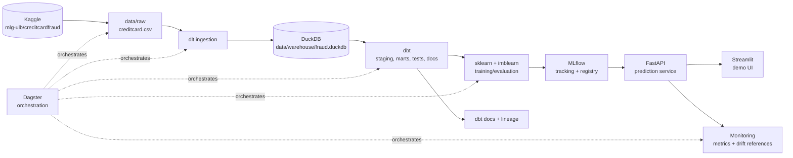
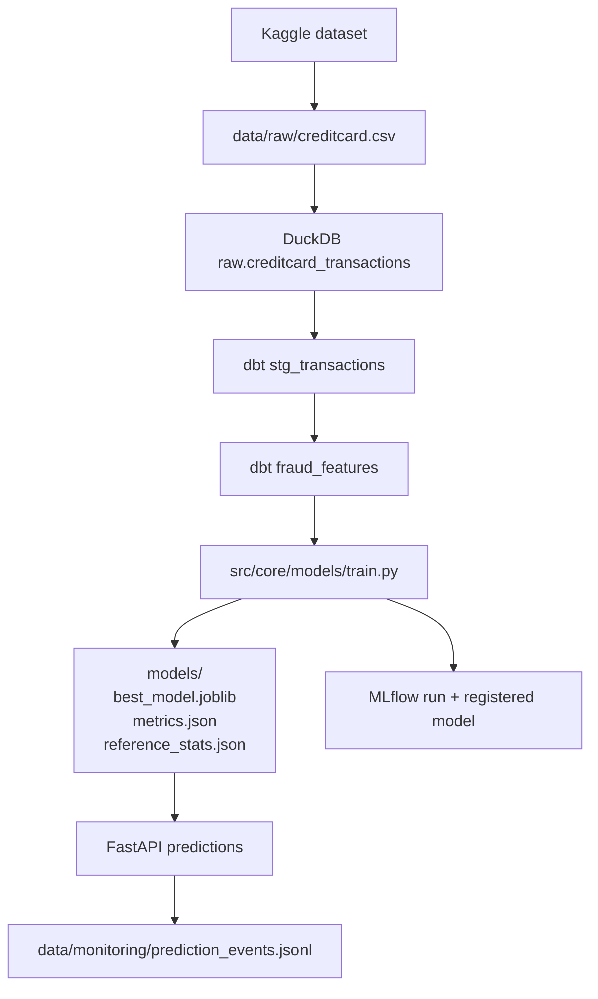

# Architecture

## Vue d'ensemble
Le projet suit une chaîne DataOps/MLOps complète:

## Composants
- Source: `kagglehub.dataset_download("mlg-ulb/creditcardfraud")`.
- Ingestion: `src/core/data/ingestion.py` charge le CSV dans `raw.creditcard_transactions`.
- Stockage analytique: DuckDB dans `data/warehouse/fraud.duckdb`.
- Transformations: `dbt_fraud` produit `stg_transactions` et `fraud_features`.
- Qualité: contrat YAML, validation Python, tests dbt `not_null` et `accepted_values`.
- Machine Learning: `src/core/models/train.py` exécute split stratifié, SMOTE dans la CV, sélection validation, évaluation test.
- Registry: MLflow tracke paramètres, métriques, artefacts et modèle enregistré.
- Serving: FastAPI expose `/health`, `/predict`, `/batch_predict`, `/metrics`, `/model/info`.
- Interface: Streamlit consomme l'API.
- Historique: PostgreSQL stocke les prédictions.
- Orchestration: Dagster matérialise les assets du pipeline.
- CI/CD: GitHub Actions teste et construit l'image container.

## Lineage

## Monitoring
- Disponibilité: `GET /health`.
- Temps de réponse: moyenne exposée par `/metrics`.
- Métriques ML runtime: taux de fraude, probabilité moyenne, volume de prédictions.
- Drift simple: comparaison possible avec `models/reference_stats.json` et les événements `data/monitoring/prediction_events.jsonl`.
