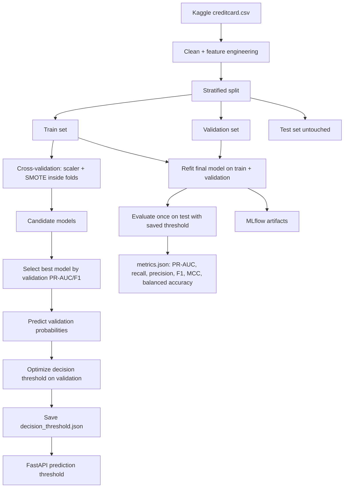

# Diagnostic de l'accuracy élevée du modèle

## Résumé

L'accuracy proche de `0.9999` ne prouve pas que le modèle est excellent. Le dataset Kaggle Credit Card Fraud Detection est extrêmement déséquilibré: les fraudes représentent environ `0.17%` des transactions. Dans ce contexte, un modèle naïf qui prédit toujours `non-fraude` obtient déjà une accuracy proche de `99.83%`.

Le problème principal n'est donc pas forcément un data leakage. Le problème est l'utilisation de l'accuracy comme indicateur central pour un problème de rare event classification.

## Pourquoi l'accuracy est trompeuse

Exemple avec la matrice de confusion sauvegardée avant correction:

```text
TN = 42485
FP = 3
FN = 15
TP = 56
```

Formule:

```text
accuracy = (TP + TN) / (TP + TN + FP + FN)
         = (56 + 42485) / (56 + 42485 + 3 + 15)
         = 0.999577
```

Cette valeur est dominée par les vrais négatifs (`TN`), car la majorité des lignes sont non frauduleuses. Elle masque le point métier critique: combien de fraudes sont détectées et combien sont ratées.

## Métriques à utiliser

Pour ce projet, les métriques principales doivent être:

- `PR-AUC`: qualité du ranking dans un dataset fortement déséquilibré.
- `Recall`: part des fraudes réellement détectées.
- `Precision`: part des alertes qui sont réellement des fraudes.
- `F1-score`: compromis precision/recall.
- `Balanced accuracy`: moyenne entre recall fraude et recall non-fraude.
- `MCC`: métrique robuste pour classification binaire déséquilibrée.
- `False negative rate`: part des fraudes manquées.
- `False positive rate`: coût opérationnel des fausses alertes.

L'accuracy reste disponible dans `metrics.json`, mais uniquement comme métrique secondaire.

## Diagnostic leakage

Le pipeline actuel respecte les points importants:

- Feature engineering avant split, mais uniquement avec des transformations row-wise sans target leakage.
- Split stratifié train/validation/test.
- `RobustScaler` dans le pipeline imblearn, donc fit uniquement sur les folds d'entraînement.
- `SMOTE` dans le pipeline imblearn, donc appliqué uniquement aux folds d'entraînement pendant la cross-validation.
- Test set utilisé une seule fois après sélection du modèle et du seuil.

Conclusion: l'accuracy élevée vient surtout du déséquilibre de classes, pas d'un data leakage évident dans le code courant.

## Correction appliquée

La correction consiste à séparer deux problèmes:

1. Le modèle produit une probabilité de fraude.
2. La décision métier `fraude / non-fraude` dépend d'un seuil.

Avant correction, le pipeline utilisait implicitement le seuil par défaut du classifieur (`0.5`) via `model.predict()`.

Après correction:

- Le modèle est sélectionné avec des métriques adaptées (`PR-AUC`, `F1` validation).
- Un seuil de décision est optimisé sur le validation set uniquement.
- Le test set est évalué une seule fois avec ce seuil.
- Le seuil est sauvegardé dans `models/decision_threshold.json`.
- L'API utilise ce seuil sauvegardé pour `prediction` et `is_fraud`.

## Diagramme du flux corrigé



## Ce qu'il faut regarder après réentraînement

Après `python -m src.train`, vérifier:

- `models/metrics.json`
- `models/decision_threshold.json`
- MLflow run
- Matrice de confusion
- `recall`, `precision`, `f1_score`, `pr_auc`, `balanced_accuracy`, `mcc`

Ne pas conclure à partir de `accuracy` seule.

## Commandes de rerun

```bash
conda activate ml-api
cd fraud-detection
python -m src.train
python -m src.evaluate
```

Pour l'API:

```bash
uvicorn api.main:app --reload --port 8000
curl http://localhost:8000/model/info
curl http://localhost:8000/metrics
```

## Interprétation attendue

Il est normal que l'accuracy reste très haute, car le dataset contient très peu de fraudes. Le résultat professionnel attendu est plutôt:

- Une accuracy élevée mais explicitement non prioritaire.
- Une PR-AUC correcte.
- Un recall et une precision discutés comme compromis métier.
- Une matrice de confusion interprétée en coût métier.
- Un seuil de décision justifié par validation, pas choisi arbitrairement.
