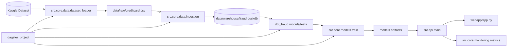

# Repository Structure

This repository now uses a clean source layout while keeping backward-compatible wrappers for existing commands, notebooks, Docker, and CI.

## Canonical Layout

```mermaid
flowchart TB
    Root["MLopsProject"]

    Root --> Src["src"]
    Root --> Compat["Compatibility wrappers"]
    Root --> Orchestration["Orchestration and transformations"]
    Root --> Delivery["Documentation and deliverables"]
    Root --> Quality["Tests"]
    Root --> Runtime["Runtime files"]

    Src --> Data["core/data<br/>Kaggle loader<br/>preprocessing<br/>feature engineering<br/>dlt/DuckDB ingestion"]
    Src --> Models["core/models<br/>training<br/>evaluation<br/>prediction<br/>threshold metrics"]
    Src --> Monitoring["core/monitoring<br/>Prometheus metrics<br/>drift reference stats"]
    Src --> Pipeline["core/pipeline<br/>local runner<br/>dashboard<br/>diagram generation"]
    Src --> ApiImpl["api<br/>FastAPI implementation"]
    Src --> DbImpl["db<br/>SQLAlchemy implementation"]
    Src --> Utils["utils<br/>data contract validation<br/>shared helpers"]

    Compat --> ApiCompat["api<br/>uvicorn api.main:app"]
    Compat --> DbCompat["db<br/>legacy DB imports"]
    Compat --> DataOpsCompat["dataops<br/>ingestion CLI"]
    Compat --> MonitoringCompat["monitoring<br/>legacy monitoring imports"]

    Orchestration --> DBT["dbt_fraud<br/>DuckDB transformations and tests"]
    Orchestration --> Dagster["dagster_project<br/>Dagster assets"]

    Delivery --> Guides["docs/guides<br/>install, usage, Colab"]
    Delivery --> Architecture["docs/architecture<br/>architecture, model diagnosis"]
    Delivery --> ProjectDocs["docs/project<br/>vision, Agile, final report"]
    Delivery --> ReportDocs["docs/reports<br/>changes, experiment notes"]
    Delivery --> Latex["reports/latex<br/>academic report"]
    Delivery --> Colab["notebooks/colab<br/>training/evaluation notebook"]

    Quality --> Unit["tests/unit"]
    Quality --> Integration["tests/integration"]

    Runtime --> Docker["Dockerfile<br/>docker-compose.yml"]
    Runtime --> Requirements["requirements.txt<br/>requirements-colab.txt"]
```



## Import Policy

New code should import from the canonical modules:

```python
from src.core.data.dataset_loader import ensure_dataset
from src.core.models.train import run_training_pipeline
from src.api.main import app
from src.db.database import SessionLocal
```

Legacy imports remain supported:

```python
from src.dataset_loader import ensure_dataset
from src.train import run_training_pipeline
from api.main import app
```

## Runtime Commands

The existing public commands still work:

```bash
python -m src.train
python -m src.evaluate
python -m dataops.ingestion
uvicorn api.main:app --reload --port 8000
streamlit run webapp/app.py
dagster dev -m dagster_project.definitions
podman compose up --build
```

## Architecture View



## Current Decision

`dbt_fraud/`, `dagster_project/`, `webapp/`, root `Dockerfile`, and root `docker-compose.yml` remain at their current paths because external tools and documentation already depend on them. The codebase is clean internally, while operational entrypoints stay stable for the project defense and demo.
