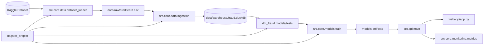

# Repository Structure

This repository now uses a clean source layout while keeping backward-compatible wrappers for existing commands, notebooks, Docker, and CI.

## Canonical Layout

```text
MLopsProject/
├── src/
│   ├── core/
│   │   ├── data/          # Kaggle loader, preprocessing, feature engineering, dlt/DuckDB ingestion
│   │   ├── models/        # Training, evaluation, prediction, threshold and metrics logic
│   │   ├── monitoring/    # Prometheus-style metrics, drift/reference stats
│   │   └── pipeline/      # Local pipeline runner, dashboard, diagram generation
│   ├── api/               # FastAPI application implementation
│   ├── db/                # SQLAlchemy database implementation
│   └── utils/             # Data contract validation and shared helpers
├── api/                   # Compatibility wrappers for uvicorn api.main:app
├── db/                    # Compatibility wrappers for legacy imports
├── dataops/               # Compatibility wrapper for ingestion CLI
├── monitoring/            # Compatibility wrappers for monitoring imports
├── dbt_fraud/             # dbt project for DuckDB transformations and tests
├── dagster_project/       # Dagster assets for orchestration
├── notebooks/colab/       # Google Colab training/evaluation notebook
├── docs/
│   ├── guides/            # Installation, usage, Colab guide
│   ├── architecture/      # Architecture and modeling diagnosis
│   ├── project/           # Vision, Agile, final report, repository structure
│   └── reports/           # Change logs and experiment notes
├── tests/
│   ├── unit/
│   └── integration/
└── reports/latex/         # Academic LaTeX report
```

## Import Policy

New code should import from the canonical modules:

```python
from src.core.data.dataset_loader import ensure_dataset
from src.core.models.train import run_training_pipeline
from src.api.main import app
from src.db.database import SessionLocal
```

Legacy imports remain supported:

```python
from src.dataset_loader import ensure_dataset
from src.train import run_training_pipeline
from api.main import app
```

## Runtime Commands

The existing public commands still work:

```bash
python -m src.train
python -m src.evaluate
python -m dataops.ingestion
uvicorn api.main:app --reload --port 8000
streamlit run webapp/app.py
dagster dev -m dagster_project.definitions
podman compose up --build
```

## Architecture View



## Current Decision

`dbt_fraud/`, `dagster_project/`, `webapp/`, root `Dockerfile`, and root `docker-compose.yml` remain at their current paths because external tools and documentation already depend on them. The codebase is clean internally, while operational entrypoints stay stable for the project defense and demo.
